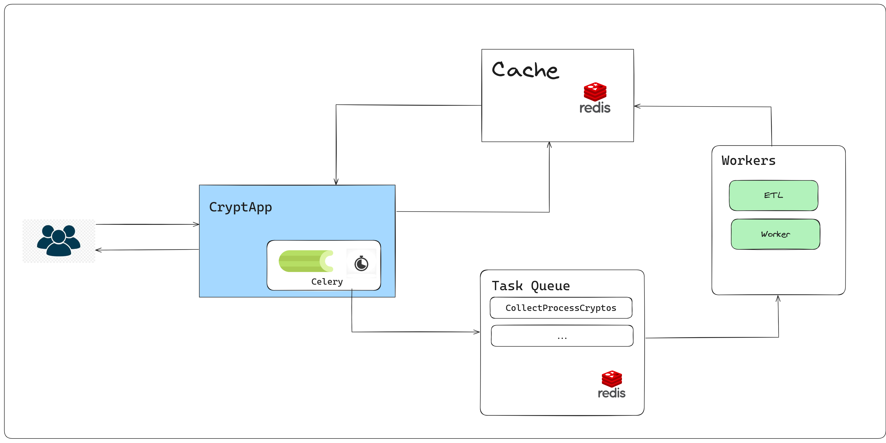

# CryptApp



## Index
1. [Introduction](#introduction)
2. [Components](#components)
3. [Arquitecture](#arquitecture)
4. [Api Docs](#api-docs)
5. [Prerequisites](#prerequisites)
6. [Dependencies](#dependencies)
7. [Installing Docker](#installing-docker)
8. [How run the Project](#how-run-the-project)
9. [Run Tests](#run-tests)


## Introduction
This document will walk you through the process of setting up the project, including installing Docker, running basic Docker commands, and understanding the dependencies required. 

## Components
Go to this page [Components](./docs/components.md)


## Api Docs
Go to this page [Api Doc](./docs/endpoints.md)

## Prerequisites
Before installing Docker, ensure you have the following:
- A 64-bit operating system.
- Administrative privileges on your machine.

## Dependencies
```
pydantic==2.5.3
fastapi==0.111.0
fastapi-injector==0.6.0
injector==0.22.0
requests==2.32.3
python-decouple==3.8
simple-settings==1.2.0
redis==5.0.8
pandas==2.2.2
celery==5.4.0
```

## Installing Docker

Check this links:
1. For windows: [How install docker on Windows?](https://docs.docker.com/desktop/install/windows-install/)
2. For Mac: [How install docker on Mac?](https://docs.docker.com/desktop/install/mac-install/)
3. For Linux: [How install docker on Linux](https://docs.docker.com/desktop/install/linux-install/)

## How run the project

### Prerequisites:

- Docker should be installed before run the project. Go to this link to check [How install docker](#installing-docker)


Execute the following command
```bash
sh deploy.sh
```
this command run the four main services on docker. (redis, api, celery workers, celery_beat). to check if the services are running successfully run the command `docker ps`. 


## Run Tests

 Execute this command in your terminal
```bash
sh run_tests.sh 
```