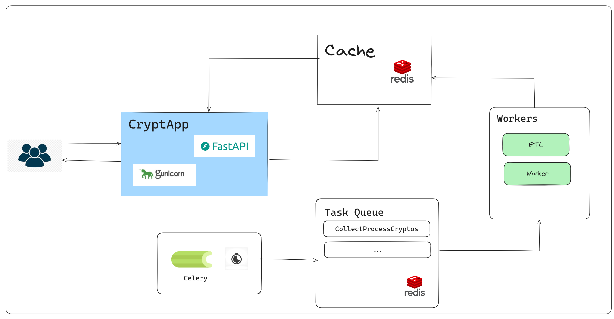

# Tic Tac Toe Game



## Index
1. [Introduction](#introduction)
2. [Arquitecture](#arquitecture)
4. [Api Docs](#api-docs)
5. [Prerequisites](#prerequisites)
6. [Dependencies](#dependencies)
7. [Installing Docker](#installing-docker)
8. [How run the Project](#how-run-the-project)
9. [How run the project with docker?](#how-run-the-project-with-docker)
10. [For Local Development](#for-local-development)
11. [Run Tests](#run-tests)


## Introduction
This document will walk you through the process of setting up the project, including installing Docker, running basic Docker commands, and understanding the dependencies required. 


## Api Docs
Go to this page [Api Doc](./docs/endpoints.md)

## Prerequisites
Before installing Docker, ensure you have the following:
- A 64-bit operating system.
- Administrative privileges on your machine.

## Dependencies
```
pydantic==2.5.3
fastapi==0.111.0
fastapi-injector==0.6.0
injector==0.22.0
requests==2.32.3
python-decouple==3.8
simple-settings==1.2.0
redis==5.0.8
pandas==2.2.2
celery==5.4.0
```

## Installing Docker

Check this links:
1. For windows: [How install docker on Windows?](https://docs.docker.com/desktop/install/windows-install/)
2. For Mac: [How install docker on Mac?](https://docs.docker.com/desktop/install/mac-install/)
3. For Linux: [How install docker on Linux](https://docs.docker.com/desktop/install/linux-install/)

## How run the project


Prerequisites:
1. A redis server up. You can use one of the docker defined services, check this [How run the project with docker?](#how-run-the-project-with-docker)
2. python3.10 installed and configurated. 
3. Write access in the root folder of the project.

> **Note:**
> The below commands are for linux OS. Change these according your OS. If you have trouble with this, please check this topic. [How run the project with docker?](#how-run-the-project-with-docker). 

Follow this steps:
1. Create a virtual environment, you can use tools like [virtualenv](https://virtualenv.pypa.io/en/latest/), [pipenv](https://pipenv.pypa.io/en/latest/), [venv](https://docs.python.org/3/library/venv.html), etc. 
2. Activate your environment 
```bash
source env/bin/activate
```

3. Install Dependencies
```bash
pip install -r requirements.txt
```

4. Go to app folder
```bash
cd app
```
5. Run the migrations.
```bash
python manage.py migrate
```
6. Define the following envaironment variables in the `.env` file.
```conf
REDIS_CHANNEL_HOST=localhost
REDIS_CHANNEL_PORT=6379
```

7. Define Allowed hosts
```conf
ALLOWED_HOSTS=localhost,127.0.0.1,your-custo-host
```

8. Run the server
```bash
python manage.py runserver 8080
```

9. Make an healthcheck request to the API to check if is running. 
```bash
curl --location 'localhost:8080/api/v1/health'
```

## How run the project with docker

Run this command in your terminal. 
```bash
docker compose -f ./deployments/docker-compose.yml up 
```


## For Local Development 
1.Execute this command in your terminal
```bash
pip install -r requirements/dev.txt
```
2. Install pre-commits
```bash
pre-commit install
```
3. Debug the app. 
```bash
# .env
DEBUG=True
```

## Run Tests
1. Go to the app 
folder
```bash
cd app
```

2. Execute this command in your terminal
```bash
python -m pytest -vv . 
```