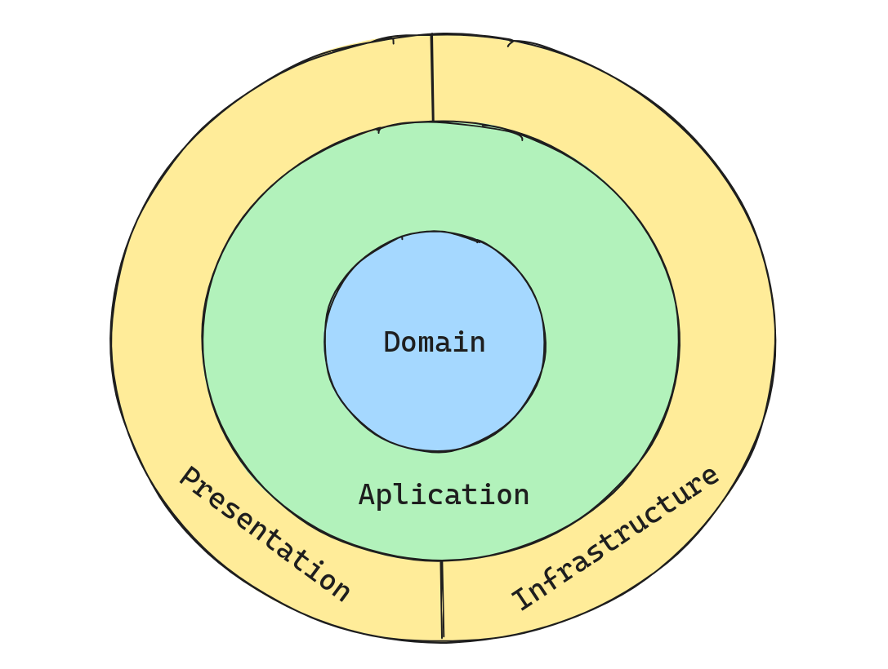

# Hexagonal Architecture

Hexagonal Architecture, also known as Ports and Adapters Architecture, is a design approach that aims to create more modular, maintainable, and adaptable applications. This architectural style focuses on isolating the core of the application from external details, allowing different parts of the system to interact through well-defined interfaces.

## Layers of Hexagonal Architecture

### 1. Domain

The **Domain** layer represents the core of the application, where the pure business logic resides. Here, domain models and rules governing business processes are defined. This layer is entirely independent of any external technology.

### 2. Application

The **Application** layer acts as an orchestrator, managing the use cases of the application. This layer contains no business logic but coordinates operations between the domain and external layers. Application services in this layer interact with the domain through interfaces.

### 3. Presentation

The **Presentation** layer is responsible for user interaction. In a hexagonal architecture, this layer is divided into different presentation adapters that enable various forms of communication with the application.

### 4. Infrastructure

The **Infrastructure** layer handles technical details and integrations with external services. This is where adapters for different technologies and services the application needs are implemented.
